# Mermaid Diagram Templates

Quick-copy templates for common diagrams. View rendered versions on GitHub or in Cursor (Cmd+Shift+V).

---

## Flowchart (Top-Down)

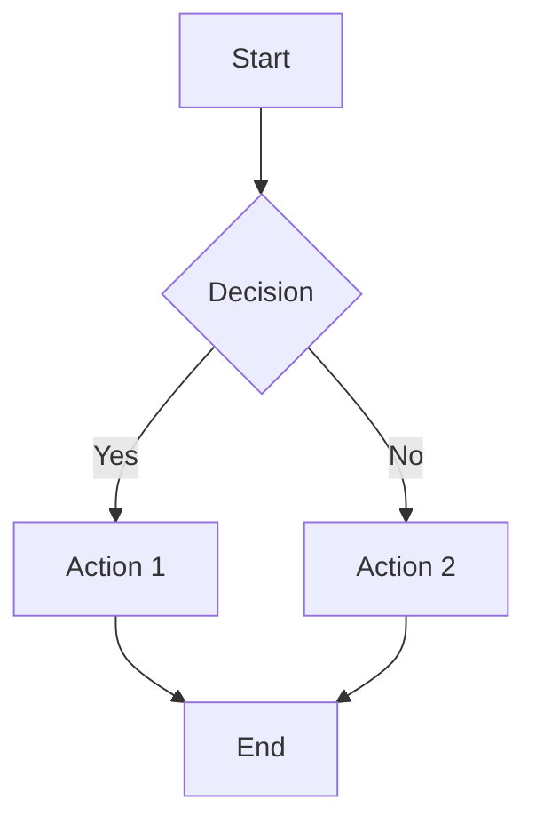

## Flowchart (Left-Right)

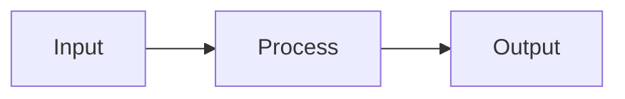

---

## Architecture Diagram

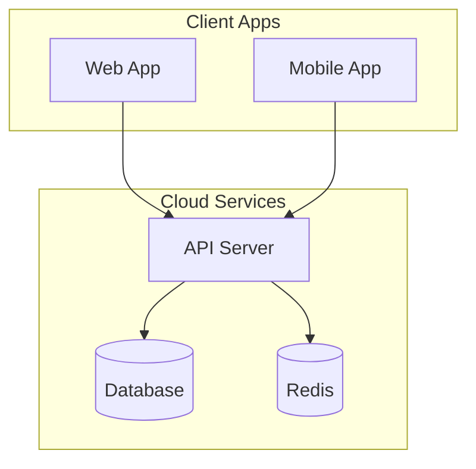

---

## Sequence Diagram

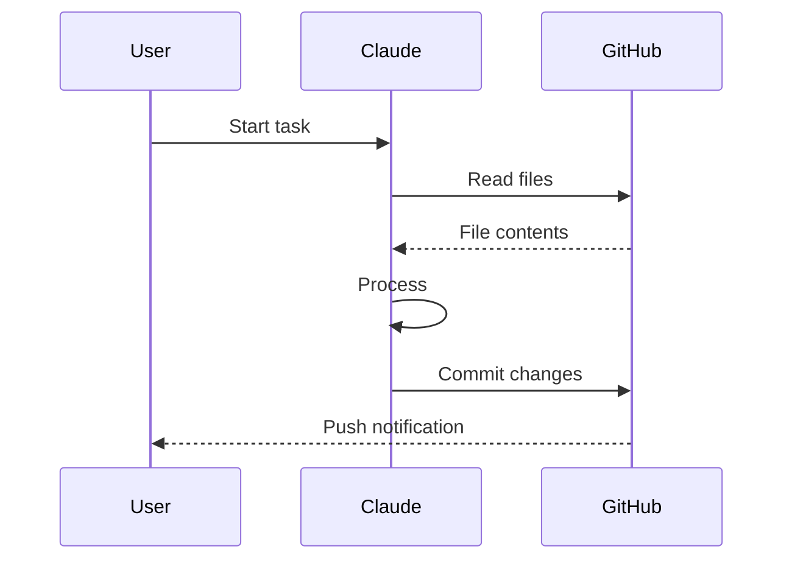

---

## Git Flow

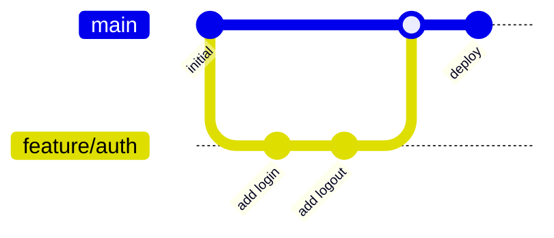

---

## State Diagram

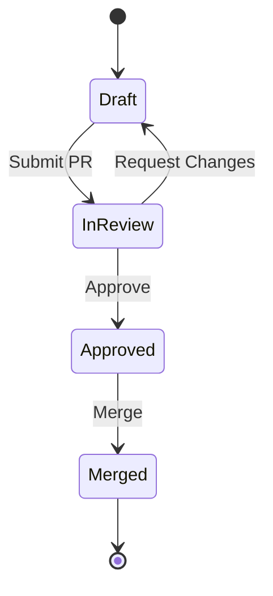

---

## Entity Relationship

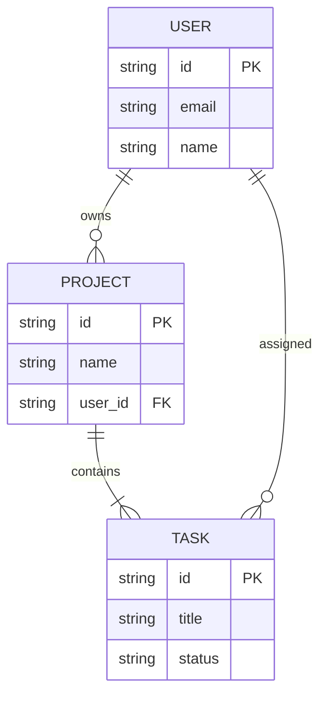

---

## Timeline

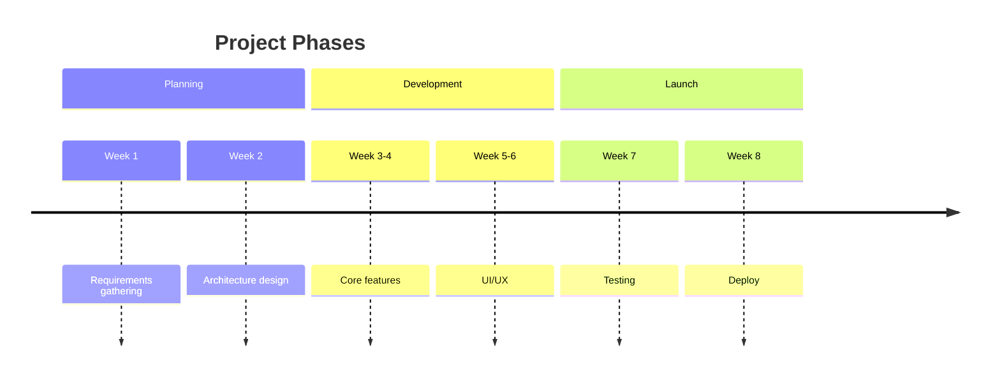

---

## Pie Chart

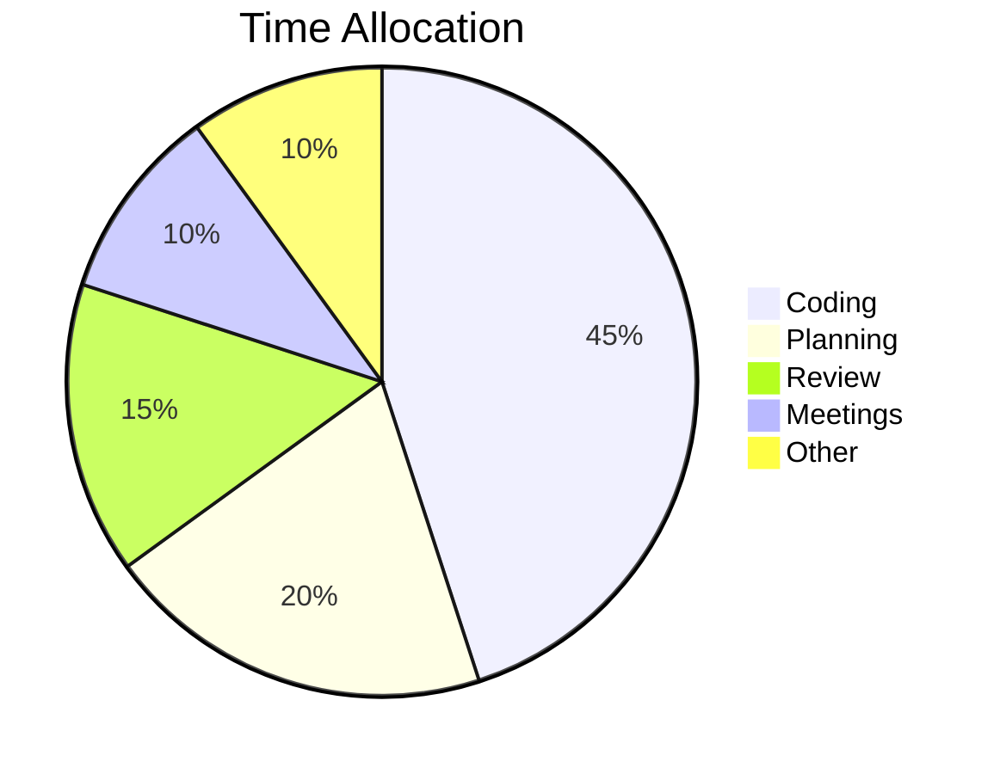

---

## Dark Theme Styling

Add this at the top of any diagram for dark-friendly colors:

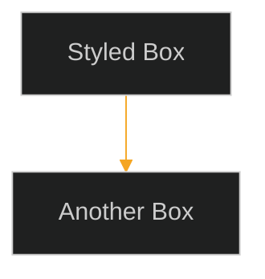

---

## Your Workflow Diagram

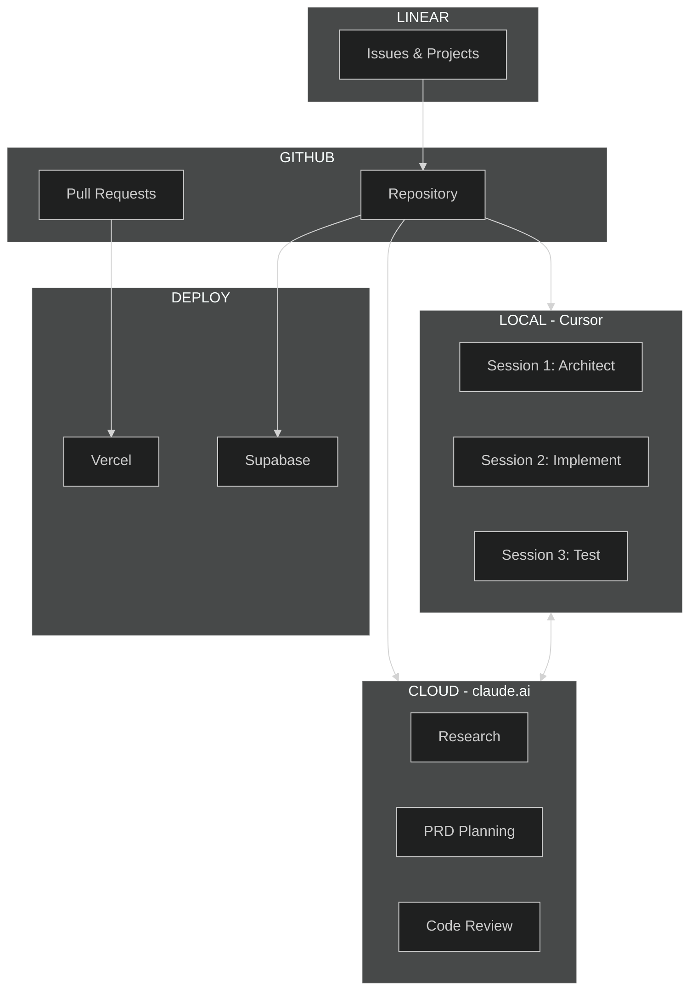

---

## Tips

1. **View in GitHub**: Push any .md file with mermaid blocks - GitHub renders them
2. **View in Cursor**: `Cmd+Shift+V` to open markdown preview
3. **Export to image**: Use `mmdc -i file.mmd -o file.png` (needs mermaid-cli)
4. **Live editor**: https://mermaid.live - paste code, see results instantly
